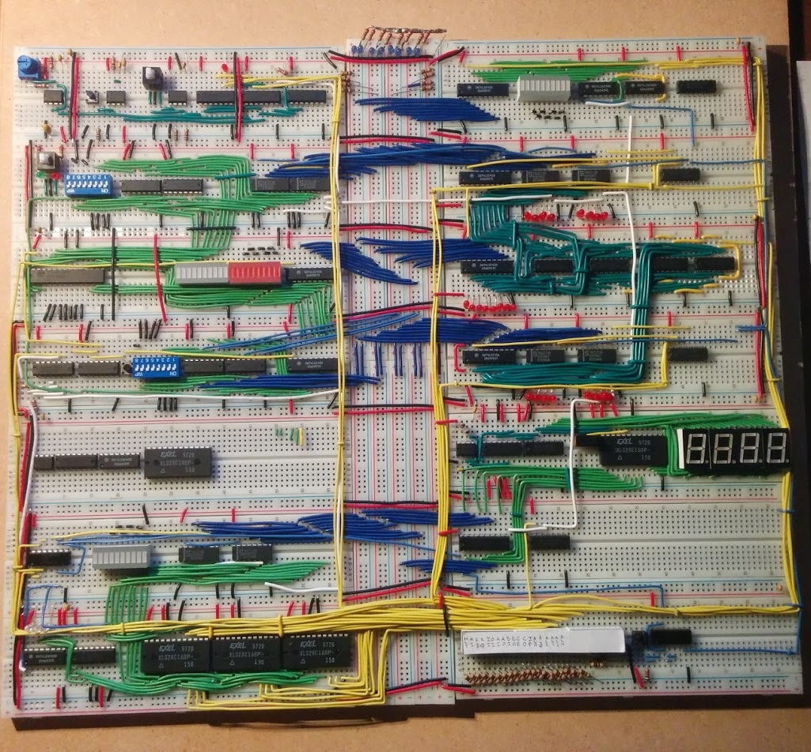

# SAP1 Breadboard Computer
The "Simple as Possible" design of computer.

* 8-bit shared data/address bus
* 256 bytes memory
* Variable rate clock with manual step mode
* Adds or subtracts
* No conditional branches

