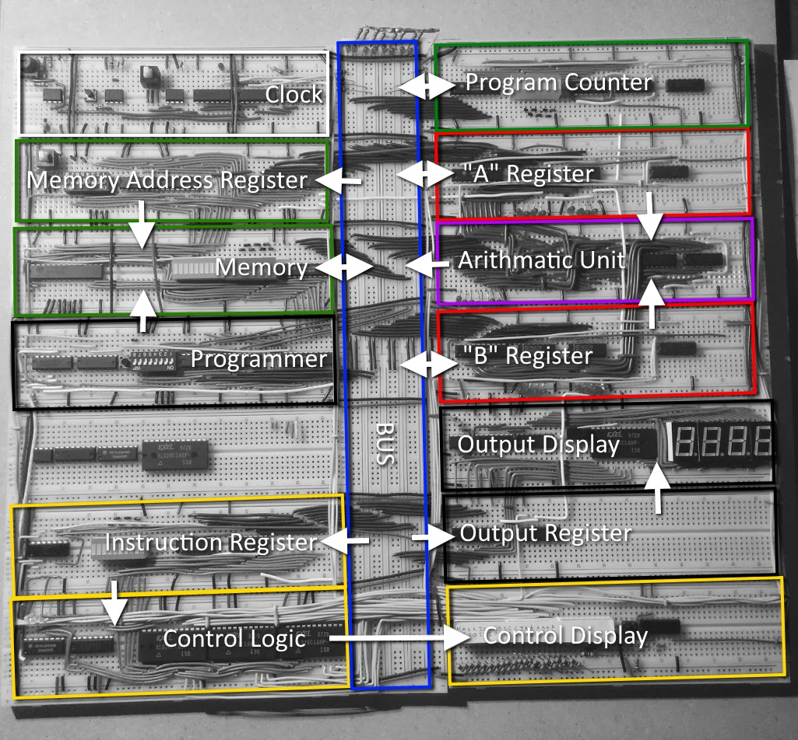

# SAP1 Breadboard Computer
The "Simple as Possible" design of computer.

## Features
* 8-bit shared data/address bus.
* 256 bytes memory.
* Variable rate clock, between 1hz and 10khz, with manual step mode.
* Supports adding *and* subtracting!
* Display in signed or unsigned mode.

## Future Work
* More ALU operations including OR, AND, XOR
* Conditional Branching
* Storage module

## Current Progress

